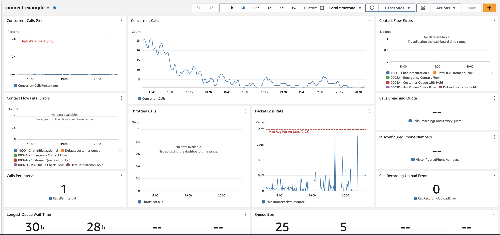
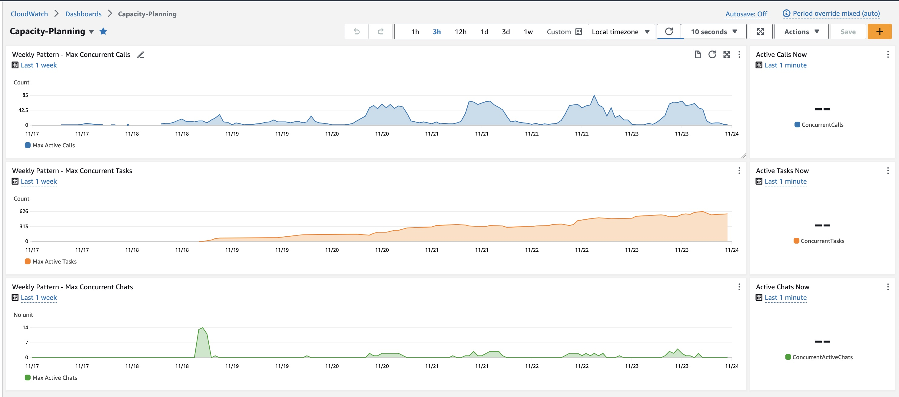

## Purpose

This project's intent is to automate the creation and deployment of a Cloudwatch dashboard to monitor critical metrics for an Amazon Connect instance. CloudWatch Dashboards provide AWS Administrators with a visualisation reference around the Amazon Connect instance performance.

It is made of two parts:
    - a Cloudformation stack (deployed from a SAM template that has been published to AWS Serverless Application Repo).
    - a Lambda Function.

The SAR application will deploy a CloudFormation stack that will create the dashboard by triggering the Lambda as a custom resource. The deletion of the dashboard is also handled when the stack is deleted.

The Lambda Function gathers the Amazon Connect instance necessary objects (queues, contact flows, etc...) and responds to Cloudformation events to create the relevant dashboard.

The dashboard created allows to monitor:
    - Concurrent Calls (%)
    - Concurrent Calls (number)
    - Throttled Calls (number)
    - Contact Flow Errors
    - Contact Flows Fatal Errors
    - Longest Queue Wait Time
    - Packet Loss Rate
    - Calls Per Interval
    - Call Recording Upload Error
    - Misconfigured Phone Numbers
    - Calls Breaching Quota

## Example Dashboards

### Infrastructure Dashboard

This dashboard provides information from an "infrastructure" view along with possible errors within the Amazon Connect flows.

### Capacity Planning Dashboard

This dashboard provides information for capacity planning around active Calls / Chats / Tasks and the a fixed weekly view of the Max Interactions by channel.

## How-to use

- Go to AWS Serverless Application Repository and search for "amazon-connect-cloudwatch-dashboard" or click [here](https://ap-southeast-2.console.aws.amazon.com/serverlessrepo/home?region=ap-southeast-2#/published-applications/arn:aws:serverlessrepo:ap-southeast-2:699520165046:applications~amazon-connect-cloudwatch-dashboard)
- Enter the name of the dashboard that will be created (without spaces or special characters)
- Enter the Amazon Connect instance ID (not the full ARN)

## Authors

- @karl-mentzer-vf
- @aurelienaws